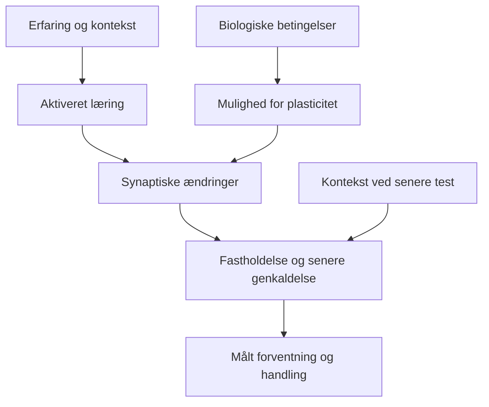

# Biokemi: fra signal til hukommelse

**Læsemål:** Forstå, hvordan en kort oplevelse kan ændre senere reaktioner, og hvor FearPrimes biologiske hypoteser passer ind. Dokumentet er en undervisningssyntese. De enkelte signalveje er ikke tilsammen en påvist årsagskæde for PTSD eller en bestemt præparatkombination.

**Kort læsevej:** Afsnit 2–5 forklarer synapsen og ændringer inde i cellen. Afsnit 9–12 gennemgår GABA, noradrenalin, acetylcholin og BNST. Afsnit 13 samler begreberne.

## 1. Fire niveauer, som skal forbindes

| Niveau | Hvad der undersøges | Eksempel på måling |
|---|---|---|
| Molekyle | Receptorer, enzymer og signalstoffer | Enzymaktivitet, receptorbinding, proteinfosforylering |
| Celle og synapse | Kommunikation og ændring af forbindelser | Elektriske strømme, receptorplacering, dendritiske spines |
| Kredsløb | Samspil mellem cellepopulationer og regioner | Elektrofysiologi, billeddannelse, selektiv manipulation |
| Læring og funktion | Forventninger, handlinger og fastholdelse | Forventningsskala, undgåelse, senere genkaldelse |

Et positivt resultat på ét niveau dokumenterer ikke automatisk det næste. Eksempelvis kan øget genekspression vise en biologisk ændring uden at vise, hvilken oplevelse der blev lært.

## 2. Den hurtige kommunikation: glutamat og synapsen

En synapse er et kontaktsted mellem celler. Glutamat kan aktivere AMPA- og NMDA-receptorer på den modtagende celle. AMPA-receptorer bidrager til hurtig depolarisering: spændingsforskellen over membranen bliver mindre negativ.

NMDA-receptorer fungerer i mange synapser som en kobling mellem aktivitet og plasticitet. Kanalåbning kræver glutamat og en koagonist som glycin eller D-serin; membranpotentialet påvirker samtidig magnesiumblokaden. Calcium kan derefter strømme ind og aktivere intracellulære processer.

Calcium binder bl.a. calmodulin, som kan aktivere enzymet **CaMKII**. Ændret placering og funktion af AMPA-receptorer er en måde, synapsens respons kan ændres på. Chen 2024 fandt hurtig ophobning af NMDA-receptorer, CaMKII og senere AMPA-receptorer i dyrkede, umodne hippocampusneuroner. Det er et cellefund, ikke direkte dokumentation for voksnes traumeminder. [Primærstudie](https://doi.org/10.3389/fnsyn.2024.1291262).

**LTP** betyder vedvarende forstærkning af synaptisk transmission; **LTD** betyder vedvarende svækkelse. Udslukning kan involvere ny læring og ændringer i flere forbindelser. Den kan derfor ikke reduceres til at svække samtlige “frygtsynapser”. Se [glutamatmodulet](NMDA_AMPA_GLUTAMATE_PLASTICITY.md).

## 3. Fra kort signal til længere ændring

**Fosforylering** er tilføjelse af en fosfatgruppe til et molekyle, ofte et protein. Kinaser kan udføre tilføjelsen; fosfataser kan fjerne gruppen. Dermed ændres bl.a. proteiners aktivitet eller samspil. Det er en regulering af eksisterende molekyler og skal adskilles fra at fremstille nye proteiner.

**Transkription** er dannelse af RNA ud fra DNA. **Translation** er fremstilling af protein ud fra mRNA. Nogle mere vedvarende synaptiske ændringer kræver ændret genudtryk og proteinsyntese. Et enkelt gen fungerer dog ikke som en færdig hukommelse: betydningen afhænger af, hvilke celler og forbindelser der ændres.

I denne sammenhæng er **CREB** en transkriptionsfaktor, der forbinder signalering med regulering af genudtryk. **cAMP** er et intracellulært signalmolekyle, og **PKA** en kinase, som cAMP kan aktivere. Signalvejene er netværk med flere indgange, ikke én obligatorisk kæde for al læring. [Farmakologisk grundlag](https://open.lib.umn.edu/pharmacology/chapter/g-protein-coupled-receptors/) · [mekanismekort](HDAC_BDNF_5HT7_DOPAMINE.md).

## 4. BDNF og TrkB: signalstof og modtager

**BDNF** er en neurotrofin, som kan aktivere **TrkB**, en receptortyrosinkinase. Aktiveret TrkB kan koble til flere intracellulære veje, bl.a. PLCγ-, MAPK/ERK- og PI3K/Akt-signalering. De vedrører forskellige aspekter af cellefunktion og plasticitet og er ikke udskiftelige.

Minichiello 2002 undersøgte ændrede TrkB-koblingssteder i mus og fandt, at PLCγ-koblingen var vigtig for hippocampal LTP i deres model. Det illustrerer, hvorfor “mere BDNF” er en upræcis mekanismebeskrivelse: receptorens efterfølgende signalering er også afgørende. [Primærkilde](https://pubmed.ncbi.nlm.nih.gov/12367511/).

Peters 2010 viste, at lokal BDNF-tilførsel i rotters infralimbiske cortex reducerede betinget frygt; virkningen var NMDA-afhængig og slettede ikke den oprindelige frygthukommelse. Det gør kredsløb og administrationssted centrale. Det viser ikke, at et kosttilskud med en perifer BDNF-effekt giver samme resultat. [Primærstudie](https://pmc.ncbi.nlm.nih.gov/articles/PMC3570764/) · [studiekort](../07_STUDIES/PRECLINICAL/2010_Peters_BDNF.md).

## 5. HDAC og kromatin: adgang til genregulering

DNA er organiseret omkring histonproteiner i kromatin. Acetylering af histoner kan ændre deres samspil med DNA og andre proteiner. Acetyltransferaser tilføjer acetylgrupper, mens histondeacetylaser, **HDAC'er**, fjerner dem. Virkningen på genudtryk afhænger af placering, proteinkomplekser og celletype; “alle gener tændes” er en forkert beskrivelse.

Guan 2009 viste i mus, at HDAC2-overekspression kunne reducere synapser, plasticitet og hukommelse, mens HDAC1-overekspression ikke gav samme mønster. Det begrunder undersøgelse af subtyper frem for en generel antagelse om, at al HDAC-hæmning er nyttig. [Primærstudie](https://www.nature.com/articles/nature07925).

Butyrat er en kortkædet fedtsyre med flere biologiske funktioner. At det kan hæmme HDAC i bestemte forsøg fortæller ikke, hvilken fri koncentration en oral formulering giver i hjernen. En ændring i adfærd må derfor ikke omdøbes til dokumenteret central HDAC2-hæmning. Det detaljerede [HDAC-kort](HDAC_BDNF_5HT7_DOPAMINE.md) adskiller enzymprofil, eksponering og målaktivering.

## 6. PNN og PV+-celler: plasticitetens strukturelle rammer

**PV+** betyder, at cellerne udtrykker proteinet parvalbumin. Mange af disse celler er GABAerge interneuroner, som indgår i reguleringen af andre neuroners aktivitet. **Perineuronale net, PNN**, er strukturer i den ekstracellulære matrix omkring bestemte celler. Aggrecan er en af deres komponenter og kodes af genet **Acan**.

Lavertu-Jolin 2023 viste i voksne mus, at manipulation af Hdac2 i PV+-celler og en tidsafgrænset reduktion af Acan kunne mindske senere spontan tilbagekomst af frygt efter udslukning. Resultatet forbinder genregulering, matrix og læring, men dokumenterer ikke, at oral butyrat giver samme celletypespecifikke effekt hos mennesker. [Primærstudie](https://pmc.ncbi.nlm.nih.gov/articles/PMC10615765/).

PNN bidrager også til stabilitet og beskyttelse. Derfor er mindre PNN ikke et generelt mål i sig selv. Se [PNN-modulet](PNN_CRITICAL_PERIOD_REOPENING.md) for regions-, timing- og celleforskelle.

## 7. Dopamin og serotonin: modulation afhænger af modtageren

Dopamin kan påvirke læringssignaler, motivation og handling. D1-lignende og D2-lignende receptorer har forskellige klassiske koblinger til intracellulær signalering. Derfor kan en ændring i dopamintilgængelighed ikke oversættes til én bestemt læringseffekt. [Receptorguiden](RECEPTORER_OG_SIGNALVEJE.md).

Humane L-DOPA-fund er heller ikke ensartede: Andres 2024 genfandt ikke den forventede samlede forbedring af udslukningsgenkaldelse. Replikationen er relevant, selv om dopaminmekanismen er biologisk plausibel. [Primærstudie](https://www.nature.com/articles/s41467-024-46936-y).

Serotoninreceptorer har ligeledes forskellige koblinger. 5-HT7 kobler klassisk til Gs/cAMP, mens 5-HT1A kobler til Gi/o. Receptorens placering på en hæmmende eller excitatorisk celle kan ændre nettovirkningen. Lurasidons receptorprofil er derfor et udgangspunkt for hypoteser, ikke en måling af udslukning. Se [lurasidons receptor- og læringskort](../04_CANDIDATES/LURASIDONE_RECEPTORS_LEARNING.md).

## 8. Hvorfor mere plasticitet ikke bestemmer læringens retning

Plasticitet beskriver mulighed for ændring. Den angiver ikke, om det lærte bliver “verden er farlig”, “denne situation er sikker” eller “jeg kan håndtere ubehaget”. Indholdet og sammenhængen i læringen skal derfor måles særskilt.

Diagrammet er en konceptuel forskningsmodel. Det angiver ikke målte effektstørrelser eller en fast tidsplan.

Et konkret humant eksempel er Ribbens 2026: hos 180 raske deltagere var natriumbutyrat forbundet med bedre senere forventningsbaseret udslukningsgenkaldelse efter omfattende træning. Der var ikke en tilsvarende samlet effekt på hudledning, og tilbagekomst efter nye ubehagelige stimuli blev ikke forhindret. Hjerneniveauets HDAC/BDNF-led blev ikke direkte målt. [Primærstudie](https://www.nature.com/articles/s41380-026-03802-1) · [fuldt studiekort](../07_STUDIES/VERIFIED/2026_Ribbens_NaBu.md).

## 9. GABA: hæmning kan være aktiv læring

**GABA** er et signalstof, som i mange modne hjernekredsløb hæmmer modtagercellens aktivitet. Hæmning betyder her, at cellen bliver mindre tilbøjelig til at sende impulser videre. Det er en lokal elektrisk funktion; det betyder ikke automatisk, at hele personen bliver rolig.

En vigtig skelnen er mellem **at dæmpe en reaktion nu** og **at lære, hvornår reaktionen ikke længere er nødvendig**. Udslukning kan involvere, at bestemte hæmmende forbindelser bliver bedre til at regulere frygtens udtryk. Den oprindelige forbindelse mellem signal og fare kan samtidig være bevaret.

Likhtik og kolleger undersøgte i rotter små grupper af GABAerge celler mellem amygdalas kerner, de interkalerede celler. De modtager information fra den basolaterale amygdala og sender hæmmende signaler til den centrale amygdala. Skade på disse celler svækkede udtrykket af tidligere indlært udslukning. Fundet viser betydningen af en bestemt cellepopulation; det viser ikke, at en generel stigning i GABA giver bedre traumebehandling. [Primærstudie, Likhtik 2008](https://pubmed.ncbi.nlm.nih.gov/18615014/).

**Eksempel:** To personer kan begge vise lavere kropslig reaktion. Den ene har lært en mere præcis forventning om situationen; den anden er midlertidigt mindre vågen. Reaktionen alene kan ikke skelne forklaringerne. Senere genkaldelse, forventning og funktion må undersøges hver for sig.

## 10. Noradrenalin: betydning, aktivering og timing

Noradrenalin er et modulerende signalstof. Dets virkning afhænger af receptortype, kredsløb og hukommelsesfase. Det er derfor utilstrækkeligt at beskrive det som enten et skadeligt stressstof eller en nyttig læringsforstærker.

**Reaktivering** betyder, at en tidligere hukommelse bliver hentet frem. **Rekonsolidering** betegner en efterfølgende stabilisering, når hukommelsen under bestemte betingelser er blevet foranderlig. Genkaldelse er ikke i sig selv bevis for, at dette vindue er åbnet.

I et rotteforsøg forstærkede stimulation af beta-adrenerge receptorer i amygdala efter genkaldelse frygthukommelsen og gjorde den mere modstandsdygtig over for senere udslukning. Her styrkede påvirkningen altså den eksisterende frygt frem for ny sikkerhedslæring. Lokal manipulation i rotters amygdala kan ikke direkte omsættes til virkningen af et præparat hos mennesker. [Primærstudie, Dębiec 2011](https://pubmed.ncbi.nlm.nih.gov/21394851/).

For FearPrime er spørgsmålet derfor: **Hvilken hukommelse er aktiv, når et biologisk signal ændres?** Samme overordnede idé om stærkere hukommelse kan give forskellige resultater før læring, efter læring og efter genkaldelse.

## 11. Acetylcholin: forskellige receptorer, forskellige synapser

Acetylcholin virker gennem to receptorfamilier. **Nikotinerge receptorer** er ionkanaler, mens **muskarinerge receptorer** signalerer gennem G-proteiner. Et stofs navn fortæller derfor ikke alene, hvilken cellulær proces der ændres.

Mitsushima og kolleger fandt i et gnaverforsøg, at kontekstuel frygtlæring styrkede excitatoriske synapser på hippocampus' CA1-celler gennem muskarinerge receptorer og indlejring af AMPA-receptorer. Samtidig blev hæmmende synapser styrket via nikotinerge receptorer. Det illustrerer, at læring kan ændre både excitation og hæmning i samme område. [Primærstudie, Mitsushima 2013](https://pubmed.ncbi.nlm.nih.gov/24217681/).

Studiet undersøger indlæring af en aversiv sammenhæng. Det dokumenterer ikke, at øget acetylcholin fremmer udslukning eller behandler PTSD. En mekanisme for bedre indlæring kan også understøtte indlæring af fare.

## 12. BNST: hvordan molekyler bliver til forskellige reaktioner

**BNST**, bed nucleus of the stria terminalis, er en samling kerner i den udvidede amygdala. Regionen er et eksempel på, hvorfor biokemi skal forbindes med bestemte cellepopulationer og deres forbindelser.

Kim og kolleger viste i mus, at forskellige BNST-delområder og udgående forbindelser havde forskellige, til dels modsatrettede virkninger. Nogle påvirkede undgåelsesadfærd, andre vejrtrækning eller positiv valens. Angstrelateret adfærd og kropslige reaktioner var således delvist adskillelige i forsøget. [Primærstudie, Kim 2013](https://pubmed.ncbi.nlm.nih.gov/23515158/).

Man kan derfor ikke udlede én samlet følelsestilstand af, at “BNST er mere aktiv”. Tilsvarende kan en ændring i hudledning ikke alene fortælle, om forventningen om fare er ændret. Fundet er kredsløbsforskning i mus, ikke en biologisk test for CPTSD hos mennesker.

## 13. Inde i cellen: ordene sat i forbindelse

| Led | Enkel forklaring | Hvorfor det er relevant |
|---|---|---|
| Receptor | Registrerer et signal uden for cellen | Samme signalstof kan aktivere forskellige receptorer |
| G-protein | Kobler visse receptorer til cellens indre signalering | Gs, Gi/o og Gq/11 leder signalet ad forskellige veje |
| cAMP | Et signalmolekyle inde i cellen | Kan aktivere PKA; mængden reguleres løbende |
| PLC | Et enzym, der kan danne signalmolekylerne IP3 og DAG | Forbinder receptoraktivering med bl.a. calciumsignalering |
| Calcium | Ion, der også fungerer som intracellulært signal | Tid, sted og signalmønster påvirker, hvilke processer der aktiveres |
| Kinase | Enzym, der fosforylerer målproteiner | Kan ændre eksisterende proteiners funktion og samspil |
| Transkriptionsfaktor | Protein, der medvirker til regulering af genudtryk | Kan forbinde kortvarig signalering med længerevarende ændringer |
| Synaptisk ændring | Ændring af en forbindelses styrke eller egenskaber | Betydningen afhænger af, hvilke celler forbindelsen tilhører |

Tabellen samler begreber fra afsnit 2–5 og [receptorguiden](RECEPTORER_OG_SIGNALVEJE.md). Den er et læsekort, ikke en obligatorisk rækkefølge: signalveje forgrener sig, mødes og regulerer hinanden.

**Et tænkt eksempel:** En aktiv synapse får et calciumsignal. Det ændrer aktiviteten af eksisterende proteiner og kan påvirke receptorernes placering. Ved nogle former for vedvarende plasticitet bidrager ændret genudtryk og proteinsyntese også. For at koble dette til mindre frygt skal man yderligere vise, at netop ændringen understøtter relevant læring og senere funktion. En måling af CREB eller BDNF alene opfylder ikke det krav.

## 14. Fem spørgsmål til enhver biokemisk forklaring

1. **Hvilket led er målt?** Binding, signalering, adfærd eller klinisk funktion?
2. **Hvor foregår det?** Blod, cellekultur, bestemt hjerneområde eller hele organismen?
3. **Hvornår?** Under indlæring, konsolidering eller senere genkaldelse?
4. **Hvad er alternativet?** Eksempelvis ændret vågenhed, bevægelse, forventning eller opgavedeltagelse.
5. **Kan fundet overføres?** Art, population, formulering og administrationsvej skal passe til påstanden.

Molekylær forståelse bliver stærkere, når disse forskelle bevares. Den gør ikke et ukontrolleret forløb til et mekanismeforsøg.

**Videre:** [Kredsløbskort](FEAR_CIRCUIT_MASTER_MAP.md) · [Kandidater](../04_CANDIDATES/README.md) · [Måleplan](../06_MEASUREMENT/MEASUREMENT_PLAN.md) · [Ordbog](../DANSK_ORDBOG.md).
