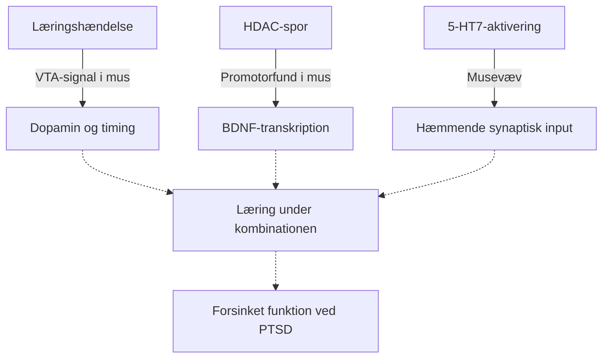

# HDAC, BDNF/TrkB, 5-HT7 og dopamin
Version 0.5 · 2026-09-17

## Hovedkonklusion
Mekanismerne giver en begrundelse for forskning, men kan ikke lægges sammen som fire positive tal. Nettovirkningen afhænger af celle, kredsløb, timing og læringsindhold. Kortet nedenfor er FearPrimes syntese, ikke en påvist årsagskæde for butyrat + Latuda hos mennesker.

Et centralt korrektiv er nu eksplicit: **HDAC-subtyper har forskellige og til dels modsatrettede funktioner i læring og plasticitet.** Guan 2009 peger på HDAC2 som en negativ regulator af synapser/plasticitet og hukommelse i mus, mens Kim 2012 viser, at forebrain-specifikt tab af HDAC4 svækker hippocampal LTP og hukommelse. Derfor må "HDAC-hæmning" aldrig behandles som én enkelt biologisk mekanisme.

## Fire forskellige niveauer
| Niveau | Spørgsmål | Evidensanker |
|---|---|---|
| HDAC/kromatin | Ændres transkriptionsbetingelser omkring bestemte gener, og hvilken HDAC-subtype er involveret? | Bredy 2007; Guan 2009; Kim 2012 |
| BDNF/TrkB | Aktiveres en plasticitetsrelevant receptor i det relevante kredsløb? | Klein 1991; Peters 2010 |
| 5-HT7 | Hvilke celler ændrer signalering og synaptisk aktivitet? | Bard 1993; Kusek 2021 |
| Dopamin | Hvilket signal når hvilke celler, og hvornår? | Salinas-Hernández 2018; Zhang 2025 |

Kilder og kontrolniveauer findes i [kildeindekset](../07_STUDIES/MECHANISTIC/MECHANISM_SOURCE_INDEX.md).

## 1. HDAC → BDNF: en mulig forbindelse
Bredy 2007 koblede udslukning til promotorspecifik histonacetylering og BDNF-transkripter i præfrontal cortex hos mus; interventionen omfattede valproat. Det understøtter en epigenetisk forbindelse, men valproat er ikke butyrat, og samme signalvej-navn dokumenterer ikke samme effekt.

I det humane butyratforsøg blev bedre forsinket forventningsbaseret genkaldelse observeret, men hjernens histonacetylering og BDNF blev ikke målt. Den fulde kæde “oral butyrat → central HDAC-hæmning → BDNF → bedre PTSD” er derfor ikke påvist. [Ribbens 2026](https://www.nature.com/articles/s41380-026-03802-1).

**Projektets testkrav:** Et adfærdsfund må ikke omdøbes til et molekylært fund. Mekanismen kræver særskilte målinger og et design, der kan skelne alternative mediatorer.

### 1A. HDAC2 og HDAC4 må ikke slås sammen
[Guan 2009](../07_STUDIES/PRECLINICAL/2009_Guan_HDAC2_Plasticity.md) viste i mus, at neuron-specifik HDAC2-overekspression reducerede dendritiske spines, synapseantal, synaptisk plasticitet og hukommelsesdannelse. Hdac2-deficiens gav flere synapser og faciliteret hukommelse. HDAC1-overekspression gav ikke samme mønster. HDAC2 var desuden associeret med promotorer for gener relateret til plasticitet og hukommelse.

[Kim 2012](../07_STUDIES/PRECLINICAL/2012_Kim_HDAC4_Plasticity.md) viste derimod, at forebrain-specifikt tab af Hdac4 svækkede hippocampus-afhængig læring, hukommelse og langvarig synaptisk plasticitet/LTP. Tab af Hdac5 gav ikke samme fænotype.

Det giver følgende subtype-korrektiv:

```text
HDAC2 ↑  → i Guan-modellen: færre synapser / svagere plasticitet / dårligere hukommelse
HDAC2 ↓  → i Guan-modellen: flere synapser / faciliteret hukommelse

HDAC4-tab → i Kim-modellen: svækket hippocampal LTP og hukommelse
```

Det er derfor biologisk forkert at bruge en generel ligning som:

`mere HDAC-hæmning = mere plasticitet = bedre fear extinction`

Den korrekte forskningsmodel er nærmere:

`effekt = HDAC-subtype × celle/kredsløb × timing × interventionsform × læringsopgave`

**FearPrime-konsekvens:** Et positivt fund med natriumbutyrat eller en anden bred HDAC-hæmmer må ikke automatisk tilskrives HDAC2, og det må heller ikke antages, at samtidig påvirkning af HDAC4 er fordelagtig. Genetisk deletion, kronisk overekspression og akut farmakologisk hæmning er forskellige interventioner. Ingen af Guan 2009 eller Kim 2012 tester PTSD-behandling hos mennesker.

## 2. BDNF → TrkB: signalstof og receptor
BDNF er ligand for TrkB, en receptortyrosinkinase; rækkefølgen er altså BDNF → TrkB ved ligandaktivering. [Klein 1991](https://pubmed.ncbi.nlm.nih.gov/1649702/).

Peters 2010 viste i rotter, at lokal BDNF i infralimbisk cortex kunne reducere betinget frygt også uden udslukningstræning. En lokal intervention er et stærkere mekanistisk holdepunkt end en korrelation, men resultatet er ikke et bevis for, at et oralt stof giver samme ændring.

**Projektets slutning:** “Mere BDNF” er et utilstrækkeligt succeskriterium. Vi skal vide hvor, hvornår og med hvilket senere adfærdsudfald. En perifer biomarkør kan ikke alene afgøre receptoraktivering i et specifikt hjernekredsløb.

## 3. 5-HT7: cellulær aktivering er ikke lig mere frygt
Bard 1993 beskrev positiv kobling til adenylatcyklase i et cellulært receptorsystem. Det støtter cAMP-sporet, ikke en generel klinisk antidepressiv eller udslukningseffekt.

Kusek 2021 fandt, at 5-HT7-aktivering i muse-amygdala kunne øge interneuronaktivitet og hæmmende input til principalneuroner. Det udfordrer forestillingen om, at aktivering nødvendigvis “skruer op for frygt”.

Det er ikke i sig selv en modbevisning af [2019-forsøget med lokal blokade og udslukning](../07_STUDIES/PRECLINICAL/2019_5HT7_BLA_extinction.md): præparat, forsøgsniveau, timing og udfald er forskellige.

**Projektets slutning:** Vi kan ikke slutte fra “Latuda blokerer 5-HT7” til “amygdala hæmmes” eller “BDNF øges via cAMP”. Den mekanistiske bro skal demonstreres, ikke tegnes som et faktum.

## 4. Dopamin: læringssignal frem for global mængde
Salinas-Hernández 2018 identificerede i mus et VTA-signal ved uventet udeblivelse af en aversiv hændelse. Tidsafgrænset optogenetisk manipulation påvirkede udslukning.

Zhang 2025 viste modsatrettede udslukningseffekter ved aktivering af forskellige VTA-projektioner til BLA-populationer.

**Projektets slutning:** En systemisk intervention kan ikke antages at ramme kun det nyttige signal. Latudas D2-blokade kan hverken sidestilles med fravær af al dopaminlæring eller antages at være uden betydning for den. D1/D2, receptorlokalisering og stofeksponering skal holdes adskilt.

Den humane L-DOPA-replikation i repoet er et separat korrektiv til direkte klinisk ekstrapolation: se [Andres 2024](../07_STUDIES/VERIFIED/2024_Andres_LDOPA_replication.md).

## Samlet kort over hypotesen
Fuld pil: observation i det angivne forsøg. Stiplet pil: uprøvet overførsel/syntese. Diagrammet viser ikke alle biologiske forbindelser.



HDAC-pilen er en forenkling af Bredy-fundene og hævder ikke, at alle HDAC-hæmmere har samme virkning. Guan 2009 og Kim 2012 gør subtype-afgrænsningen eksplicit. Dossiererne beskriver stofspecifik evidens.

## Tre konkurrerende modeller — evidenstype E
| Model | Forudsigelse | Hvad skal skelne den fra alternativer? |
|---|---|---|
| Komplementære effekter | Kombinationen forbedrer senere læring | Direkte kontrolgrupper, ikke kun før/efter |
| Akut tilstandsændring | Ro eller deltagelse ændres uden bedre fastholdelse | Separate akutte og forsinkede mål |
| Modgående kredsløbseffekter | Gevinst udebliver eller adfærd forværres | Præcise estimater, tolerabilitet og gentagelse |

## Hvad vi konkret ændrer i FearPrime
1. Registrér den præcise forbindelse, hver kilde understøtter.
2. Angiv celle/kredsløb, art, timing og målt udfaldsmål.
3. Angiv HDAC-subtype; skriv ikke bare “HDAC”, hvis kilden er subtype-specifik.
4. Kræv separate data for kombinationen.
5. Lad negative og modgående fund ændre hypotesens styrke.
6. Brug funktion og vedvarende læring som mål; receptorhistorien er en forklaring, der skal testes.

Ingen dosis, kronisk behandlingsplan eller “optimal cAMP/BDNF-værdi” kan udledes af dette kort.

## Version 0.10: fra mekanisme til afprøvning
[Kombinationshypotesen](../04_CANDIDATES/BUTYRATE_LATUDA_HYPOTHESIS.md) har nu et regnskab over manglende kausale led og fem forudsigelser. [Testplanen](../06_MEASUREMENT/FP_BL_01_TEST_PLAN.md) definerer, hvordan en effekt kan adskilles fra statistisk interaktion og en molekylær forklaring.
