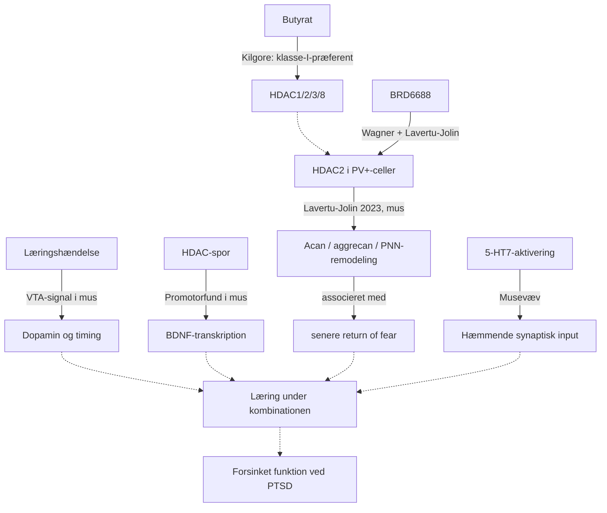

# HDAC, BDNF/TrkB, 5-HT7 og dopamin
Version 0.21 · 2026-09-17

## Hovedkonklusion
Mekanismerne giver en begrundelse for forskning, men kan ikke lægges sammen som fire positive tal. Nettovirkningen afhænger af celle, kredsløb, timing, eksponering og læringsindhold. Kortet nedenfor er FearPrimes syntese, ikke en påvist årsagskæde for butyrat + Latuda hos mennesker.

Et centralt korrektiv er eksplicit: **HDAC-subtyper har forskellige og til dels modsatrettede funktioner i læring og plasticitet.** Guan 2009 peger på HDAC2 som en negativ regulator af synapser/plasticitet og hukommelse i mus, mens Kim 2012 viser, at forebrain-specifikt tab af HDAC4 svækker hippocampal LTP og hukommelse. Lavertu-Jolin 2023 gør HDAC2-sporet mere FearPrime-specifikt ved at vise, at Hdac2-manipulation i **PV+-GABAerge interneuroner** kan ændre **Acan/aggrecan, perineuronale net og senere return of fear efter extinction**. Kilgore 2010 viser samtidig, at **butyrat ikke er en selektiv HDAC2-hæmmer**, men en klasse-I-præferent HDAC-hæmmer i rekombinante assays.

Et nyt værktøjslag er nu tilføjet: BRD6688/BRD4884 demonstrerer, at HDAC2 kan favoriseres farmakologisk gennem binding kinetics; Tamanini 2022 viser oral CNS-HDAC-PD med en brain-penetrant lead; og Suzuki 2026 beskriver en nyere cellulært HDAC2-selektiv compound 11 med in-vivo histonacetylering og LTP. **BRD6688 er fortsat den tætteste direkte FearPrime-probe**, fordi den allerede er brugt før extinction i Lavertu-Jolin-modellen.

## Fire forskellige niveauer
| Niveau | Spørgsmål | Evidensanker |
|---|---|---|
| HDAC/kromatin | Ændres transkriptionsbetingelser omkring bestemte gener, hvilken HDAC-subtype og hvilken celletype er involveret? | Bredy 2007; Guan 2009; Kilgore 2010; Kim 2012; Wagner 2015; Tamanini 2022; Lavertu-Jolin 2023; Suzuki 2026 |
| BDNF/TrkB | Aktiveres en plasticitetsrelevant receptor i det relevante kredsløb? | Klein 1991; Peters 2010 |
| 5-HT7 | Hvilke celler ændrer signalering og synaptisk aktivitet? | Bard 1993; Kusek 2021 |
| Dopamin | Hvilket signal når hvilke celler, og hvornår? | Salinas-Hernández 2018; Zhang 2025 |

Kilder og kontrolniveauer findes i [kildeindekset](../07_STUDIES/MECHANISTIC/MECHANISM_SOURCE_INDEX.md). Formuleringssporet findes i [NaBut vs. tributyrin vs. SerBut](../04_CANDIDATES/BUTYRATE_FORMULATION_HEAD_TO_HEAD.md). Selektive værktøjer findes i [HDAC2-dossieret](../04_CANDIDATES/HDAC2_SELECTIVE_INHIBITOR_DOSSIER.md).

## 1. HDAC → BDNF: en mulig forbindelse
Bredy 2007 koblede udslukning til promotorspecifik histonacetylering og BDNF-transkripter i præfrontal cortex hos mus; interventionen omfattede valproat. Det understøtter en epigenetisk forbindelse, men valproat er ikke butyrat, og samme signalvej-navn dokumenterer ikke samme effekt.

I det humane butyratforsøg blev bedre forsinket forventningsbaseret genkaldelse observeret, men hjernens histonacetylering og BDNF blev ikke målt. Den fulde kæde “oral butyrat → central HDAC-hæmning → BDNF → bedre PTSD” er derfor ikke påvist. [Ribbens 2026](https://www.nature.com/articles/s41380-026-03802-1).

**Projektets testkrav:** Et adfærdsfund må ikke omdøbes til et molekylært fund. Mekanismen kræver særskilte målinger og et design, der kan skelne alternative mediatorer.

### 1A. HDAC2 og HDAC4 må ikke slås sammen
[Guan 2009](../07_STUDIES/PRECLINICAL/2009_Guan_HDAC2_Plasticity.md) viste i mus, at neuron-specifik HDAC2-overekspression reducerede dendritiske spines, synapseantal, synaptisk plasticitet og hukommelsesdannelse. Hdac2-deficiens gav flere synapser og faciliteret hukommelse. HDAC1-overekspression gav ikke samme mønster. HDAC2 var desuden associeret med promotorer for gener relateret til plasticitet og hukommelse.

[Kim 2012](../07_STUDIES/PRECLINICAL/2012_Kim_HDAC4_Plasticity.md) viste derimod, at forebrain-specifikt tab af Hdac4 svækkede hippocampus-afhængig læring, hukommelse og langvarig synaptisk plasticitet/LTP. Tab af Hdac5 gav ikke samme fænotype.

Det giver følgende subtype-korrektiv:

```text
HDAC2 ↑  → i Guan-modellen: færre synapser / svagere plasticitet / dårligere hukommelse
HDAC2 ↓  → i Guan-modellen: flere synapser / faciliteret hukommelse

HDAC4-tab → i Kim-modellen: svækket hippocampal LTP og hukommelse
```

Det er derfor biologisk forkert at bruge en generel ligning som:

`mere HDAC-hæmning = mere plasticitet = bedre fear extinction`

Den korrekte forskningsmodel er nærmere:

`effekt = HDAC-subtype × celletype/kredsløb × timing × eksponering × interventionsform × læringsopgave`

### 1B. HDAC2 → PV+-interneuroner → Acan/aggrecan → perineuronale net → return of fear
[Lavertu-Jolin 2023](../07_STUDIES/PRECLINICAL/2023_Lavertu_Jolin_HDAC2_Acan_PNN_Extinction.md) er et direkte fear-extinction-holdepunkt i voksne mus. Celletypespecifikt tab af Hdac2 i parvalbumin-positive GABAerge interneuroner ændrede ikke tydeligt selve extinction-raten, men reducerede senere spontan tilbagekomst af frygt. Den oprindelige frygthukommelse var fortsat til stede uden extinction-træning.

Hdac2-tab var samtidig forbundet med mere PV+-synaptisk remodeling og mindre perineuronal-net-aggregation i præfrontal cortex og basolateral amygdala. I præfrontal cortex blev **Acan**, som koder for PNN-komponenten aggrecan, nedreguleret. Farmakologisk HDAC2-hæmning efter frygtindlæring og før extinction reducerede også senere spontan fear recovery. Direkte Acan-knockdown efter acquisition og før extinction gav ligeledes mindre senere fear recovery.

FearPrime kan derfor arbejde med denne **prækliniske** kæde:

```text
HDAC2 i PV+-celler
        ↓
Acan / aggrecan
        ↓
perineuronale net (PNN) og kredsløbsstabilisering
        ↓
begrænsning af voksen synaptisk remodeling
        ↓
ændret extinction-retention / return of fear
```

**Kritisk afgrænsning:** BRD6688 er ikke natriumbutyrat, tributyrin eller SerBut. Studiet beviser derfor ikke, at en oral butyratform selektivt rammer HDAC2 i humane PV+-celler.

### 1C. Butyrat rammer klasse-I-HDAC'er bredt — ikke HDAC2 alene
[Kilgore 2010](../07_STUDIES/PRECLINICAL/2010_Kilgore_Class_I_HDAC_Selectivity.md) målte direkte enzymhæmning af rekombinante humane HDAC-isoformer. For butyric acid blev følgende IC50-værdier rapporteret:

| Isoform | IC50 |
|---|---:|
| HDAC3 | 4,8 µM |
| HDAC2 | 7,0 µM |
| HDAC1 | 8,3 µM |
| HDAC8 | 10,4 µM |
| HDAC4 | 5725 µM |
| HDAC5 | 6403 µM |
| HDAC7 | 4380 µM |
| HDAC9 | 5614 µM |
| HDAC6 | 5881 µM |

Dette gør den tidligere formulering "butyrat → HDAC2" for specifik. Den biokemisk mere korrekte arbejdshypotese er:

```text
relevant intracellulær butyrateksponering
        ↓
klasse-I-præferent HDAC-hæmning
(HDAC1 / HDAC2 / HDAC3 / HDAC8)
        ↓
celletype- og kredsløbsspecifikke transkriptionsændringer
```

HDAC3 var i dette assay numerisk mere følsom end HDAC2. Derfor kan et positivt butyratfund ikke uden direkte target-engagement-data tilskrives HDAC2.

### 1D. Levering ændrer eksponering — ikke nødvendigvis selektivitet
Tre formuleringer holdes nu adskilt i FearPrime:

- **Natriumbutyrat:** har det mest direkte humane extinction-retention-signal i repoet via Ribbens 2026, men hjernens butyrat/HDAC2 blev ikke målt.
- **Tributyrin:** har human systemisk PK og et lille åbent [human PET target-engagement-signal](../07_STUDIES/VERIFIED/2026_Bohnen_Tributyrin_PET_Target_Engagement.md), men ingen direkte HDAC2- eller extinction-måling.
- **SerBut:** har den stærkeste direkte prækliniske formulering-vs-NaBut CNS-biodistribution i [Cao 2024](../07_STUDIES/PRECLINICAL/2024_Cao_SerBut_Bioavailability_Neuroinflammation.md), men ingen etableret human extinction- eller HDAC2-target-engagement-evidens.

[Frit mærket butyrat](../07_STUDIES/MECHANISTIC/2013_Kim_Butyrate_PET_Brain_Uptake.md) viste meget lav hjerneoptagelse i et primat-PET-paradigme, hvilket er endnu en grund til at holde **enzympotens** og **faktisk CNS-eksponering** adskilt.

Den snævre FearPrime-kæde er derfor stadig uprøvet:

```text
oral butyratform
→ human CNS-butyrateksponering i relevant tidsvindue
→ HDAC2 target engagement i PV+-interneuroner
→ Acan/PNN-remodeling
→ bedre varig extinction / mindre return of fear
```

Se den fulde [head-to-head-analyse](../04_CANDIDATES/BUTYRATE_FORMULATION_HEAD_TO_HEAD.md).

### 1E. HDAC2-selektive værktøjer kommer tættere på den smalle mekanisme
[Wagner 2015](../07_STUDIES/PRECLINICAL/2015_Wagner_BRD6688_BRD4884_HDAC2.md) udviklede BRD6688 og BRD4884 med CNS-egenskaber og **kinetisk præference for HDAC2** over HDAC1. Dette er ikke det samme som en perfekt HDAC2-only IC50-profil: især BRD6688 hæmmer både HDAC1 og HDAC2, men har markant længere residence time på HDAC2 og meget svagere HDAC3-potens.

Det er netop BRD6688, der blev anvendt i Lavertu-Jolin 2023 før extinction. Derfor er BRD6688 den mest direkte eksisterende farmakologiske probe til den snævre FearPrime-hypotese.

[Tamanini 2022](../07_STUDIES/MECHANISTIC/2022_Tamanini_HDAC2_Compound17.md) viste en anden løsning: en oral brain-penetrant compound 17 med in-vivo H4K12-acetylering. Den havde dog begrænset selectivity over HDAC1/8 og bruges derfor som CNS-target-engagement proof-of-concept, ikke som ren HDAC2-isolation.

[Suzuki 2026](../07_STUDIES/PRECLINICAL/2026_Suzuki_HDAC2_Compound11.md) gik videre med cellulære HDAC2-vs-HDAC1-assays. Compound 11 øgede histonacetylering in vivo og forbedrede hippocampal LTP uden den samme hæmatologiske toksicitet i deres humane blodcellemodel. Den er derfor en stærk nyere kandidat til at teste HDAC2-mekanismer, men er endnu ikke afprøvet i fear extinction/PNN-paradigmet.

FearPrime skal derfor skelne:

```text
BRD6688 → bedst direkte extinction/HDAC2/PV/PNN-match i eksisterende prækliniske data
Compound 11 → nyere stærk HDAC2-selectivity/CNS/LTP-kandidat, men uden extinction-data
Butyrat → human translational extinction-signal, men bred class-I-HDAC-biokemi
```

[Santacruzamate A/CAY10683](../07_STUDIES/MECHANISTIC/2013_2016_Santacruzamate_HDAC2_Replication.md) bruges som negativ metodekontrol: den oprindelige ekstremt potente HDAC2-påstand blev ikke reproduceret og forbindelsen må ikke behandles som valideret HDAC2-probe.

Se [HDAC2-selektivt kandidatdossier](../04_CANDIDATES/HDAC2_SELECTIVE_INHIBITOR_DOSSIER.md).

## 2. BDNF → TrkB: signalstof og receptor
BDNF er ligand for TrkB, en receptortyrosinkinase; rækkefølgen er altså BDNF → TrkB ved ligandaktivering. [Klein 1991](https://pubmed.ncbi.nlm.nih.gov/1649702/).

Peters 2010 viste i rotter, at lokal BDNF i infralimbisk cortex kunne reducere betinget frygt også uden udslukningstræning. En lokal intervention er et stærkere mekanistisk holdepunkt end en korrelation, men resultatet er ikke et bevis for, at et oralt stof giver samme ændring.

**Projektets slutning:** “Mere BDNF” er et utilstrækkeligt succeskriterium. Vi skal vide hvor, hvornår og med hvilket senere adfærdsudfald. En perifer biomarkør kan ikke alene afgøre receptoraktivering i et specifikt hjernekredsløb.

## 3. 5-HT7: cellulær aktivering er ikke lig mere frygt
Bard 1993 beskrev positiv kobling til adenylatcyklase i et cellulært receptorsystem. Det støtter cAMP-sporet, ikke en generel klinisk antidepressiv eller udslukningseffekt.

Kusek 2021 fandt, at 5-HT7-aktivering i muse-amygdala kunne øge interneuronaktivitet og hæmmende input til principalneuroner. Det udfordrer forestillingen om, at aktivering nødvendigvis “skruer op for frygt”.

Det er ikke i sig selv en modbevisning af [2019-forsøget med lokal blokade og udslukning](../07_STUDIES/PRECLINICAL/2019_5HT7_BLA_extinction.md): præparat, forsøgsniveau, timing og udfald er forskellige.

**Projektets slutning:** Vi kan ikke slutte fra “Latuda blokerer 5-HT7” til “amygdala hæmmes” eller “BDNF øges via cAMP”. Den mekanistiske bro skal demonstreres, ikke tegnes som et faktum.

## 4. Dopamin: læringssignal frem for global mængde
Salinas-Hernández 2018 identificerede i mus et VTA-signal ved uventet udeblivelse af en aversiv hændelse. Tidsafgrænset optogenetisk manipulation påvirkede udslukning.

Zhang 2025 viste modsatrettede udslukningseffekter ved aktivering af forskellige VTA-projektioner til BLA-populationer.

**Projektets slutning:** En systemisk intervention kan ikke antages at ramme kun det nyttige signal. Latudas D2-blokade kan hverken sidestilles med fravær af al dopaminlæring eller antages at være uden betydning for den. D1/D2, receptorlokalisering og stofeksponering skal holdes adskilt.

Den humane L-DOPA-replikation i repoet er et separat korrektiv til direkte klinisk ekstrapolation: se [Andres 2024](../07_STUDIES/VERIFIED/2024_Andres_LDOPA_replication.md).

## Samlet kort over hypotesen
Fuld pil: observation i det angivne forsøg. Stiplet pil: uprøvet overførsel/syntese. Diagrammet viser ikke alle biologiske forbindelser.



Den stiplede pil fra klasse-I-HDAC-hæmning til det specifikke HDAC2/PV-spor er bevidst: den forbindelse er **ikke direkte demonstreret for oral butyrat hos mennesker**. BRD6688-pilen er præklinisk og må ikke overføres direkte til human behandling.

## Tre konkurrerende modeller — evidenstype E
| Model | Forudsigelse | Hvad skal skelne den fra alternativer? |
|---|---|---|
| Komplementære effekter | Kombinationen forbedrer senere læring | Direkte kontrolgrupper, ikke kun før/efter |
| Akut tilstandsændring | Ro eller deltagelse ændres uden bedre fastholdelse | Separate akutte og forsinkede mål |
| Modgående kredsløbseffekter | Gevinst udebliver eller adfærd forværres | Præcise estimater, tolerabilitet og gentagelse |

## Hvad vi konkret ændrer i FearPrime
1. Registrér den præcise forbindelse, hver kilde understøtter.
2. Angiv celle/kredsløb, art, timing og målt udfaldsmål.
3. Angiv HDAC-subtype og celletype; skriv ikke bare “HDAC”, hvis kilden er subtype- eller celletypespecifik.
4. Skriv ikke “HDAC2-hæmning” for butyrat uden subtype-specifik target-engagement-data; standardformuleringen er **klasse-I-præferent HDAC-hæmning**.
5. Registrér formulering/PK, CNS-target engagement og HDAC-target engagement som tre separate akser.
6. Registrér **termisk/kinetisk selectivity, cellular selectivity og in-vivo target engagement separat**; de er ikke det samme.
7. Catalog-navne som “HDAC2 inhibitor” accepteres ikke uden reproducerbar profil; santacruzamate er kontrol-eksemplet.
8. Registrér PNN/Acan/aggrecan separat fra BDNF-sporet.
9. Kræv separate data for kombinationen.
10. Lad negative og modgående fund ændre hypotesens styrke.
11. Brug funktion og vedvarende læring som mål; receptorhistorien er en forklaring, der skal testes.

Ingen dosis, kronisk behandlingsplan eller “optimal cAMP/BDNF-værdi” kan udledes af dette kort.

## Version 0.21: selective-HDAC2 layer
FearPrime har nu et selvstændigt [HDAC2-selektivt kandidatdossier](../04_CANDIDATES/HDAC2_SELECTIVE_INHIBITOR_DOSSIER.md). Den centrale forskningsforskel er nu eksplicit: **butyrat er en translational bred class-I intervention; BRD6688 er den direkte prækliniske extinction/HDAC2-probe; compound 11 er en nyere selektiv CNS-kandidat uden extinction-data.**
