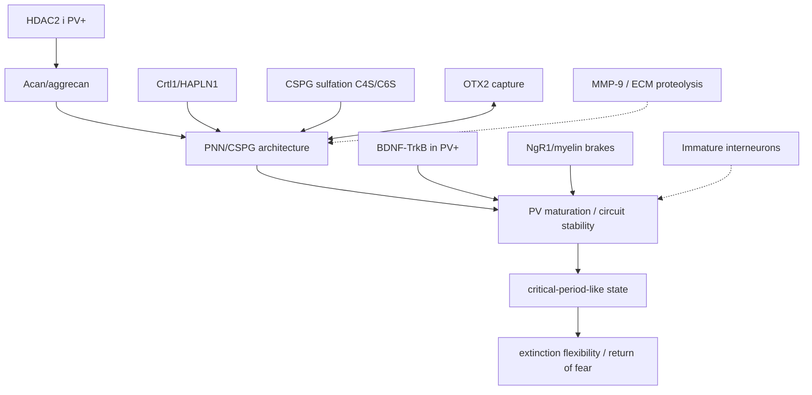

# PNN, aggrecan og reopening af critical-period-lignende plasticitet
Version 0.23 · 2026-09-17

## Formål
Dette kort samler FearPrimes prækliniske spor fra **HDAC2 → Acan/aggrecan → perineuronale net (PNN) → PV+-interneuroner → critical-period-lignende plasticitet → fear extinction/return of fear**.

Det centrale korrektiv er, at PNN ikke er én simpel "plastisitetsbremse". Effekten afhænger af **hjerneområde, tidspunkt, cellekilde, ECM-komponent og om man påvirker acquisition, extinction eller senere retrieval**.

## Kernekæde i FearPrime
```text
HDAC2 i PV+-interneuroner
        ↓
Acan / aggrecan
        ↓
PNN / CSPG-kondensation omkring PV+-celler
        ↓
modning/stabilisering af PV-netværk
        ↓
begrænset voksen synaptisk remodeling
        ↓
sværere vedvarende extinction / større risiko for return of fear
```

[Lavertu-Jolin 2023](../07_STUDIES/PRECLINICAL/2023_Lavertu_Jolin_HDAC2_Acan_PNN_Extinction.md) støtter det direkte fear-extinction-led: Hdac2-hæmning eller Acan-nedregulering omkring extinction reducerede senere spontan fear recovery i voksne mus.

## Direkte manipulationspunkter
| Mål | Intervention i litteraturen | Hvad der blev vist | FearPrime-status |
|---|---|---|---|
| **CSPG/PNN** | Chondroitinase ABC (ChABC) | Amygdala-PNN-nedbrydning før fear acquisition gjorde senere memory mere modtagelig for extinction/erasure i voksne mus | Stærkt præklinisk causal anchor |
| **Acan/aggrecan** | Conditional Acan deletion / siRNA | PNN kollapser eller transient reduceres; juvenile-like plasticity eller mindre spontaneous fear recovery afhængigt af model | Direkte relevant |
| **Crtl1/HAPLN1-linkprotein** | Crtl1 knockout | Normal CSPG-mængde men dårlig PNN-kondensation; voksne mus viste extinction-lignende fear erasure | Direkte fear-relevant |
| **OTX2 ↔ PNN** | RK-peptid / blokering af OTX2-GAG binding | Mindre OTX2-optag i PV+-celler, lavere PV/PNN og reopening af voksen cortical plasticity | Mekanistisk stærk, ikke fear-specifik |
| **BDNF/TrkB i PV+** | Kronisk fluoxetin i musemodeller | PV-TrkB-afhængig iPlasticity, PNN-reduktion og forbedret fear flexibility/erasure med træning | Direkte fear-relevant, men ikke PNN-only |
| **NgR1 / myelin-brakes** | NgR1 deletion eller blokade; Nogo/MAG/OMgp-spor | Juvenile-like fear erasure i voksne mus; krævede BLA/IL og PV+-relateret mekanisme | Parallel critical-period brake |
| **Immature interneurons** | Embryonal GABA-interneuron transplantation til amygdala | Midlertidigt juvenile-lignende vindue, færre PNN, mere LTP og mindre spontaneous recovery/renewal | Direkte, men invasiv præklinisk model |
| **CSPG sulfation** | C6S/CHST3 manipulation | 6-sulfation er mere permissiv; restoring C6S forbedrede adult/aged plasticity og LTP | Mekanistisk spor, ikke direkte fear-extinction-bevis |
| **Endogen ECM-proteolyse** | MMP-9-relateret PNN-degradering | Nyere musearbejde kobler BDNF-TrkB→MMP-9→PNN-degradering til remote fear-memory updating | Emerging, kontekstspecifik |

## 1. Chondroitinase ABC: direkte fjernelse af CSPG-kæder
[Gogolla et al. 2009](../07_STUDIES/PRECLINICAL/2009_Gogolla_PNN_Fear_Erasure.md) viste, at PNN/CSPG-modning i amygdala sammenfalder med overgangen fra juvenile erasure-lignende extinction til mere stabile voksne fear memories. ChABC i voksen amygdala gjorde **efterfølgende erhvervede** fear memories mere modtagelige for extinction-lignende erasure.

Vigtigt timing-korrektiv: ChABC givet efter fear acquisition men før extinction var i det oprindelige paradigm ikke ækvivalent med behandling før acquisition. PNN kan derfor påvirke, **hvordan fear-memory trace bliver kodet/stabiliseret**, ikke kun hvordan extinction udføres.

## 2. Acan/aggrecan: strukturelt knudepunkt
[Rowlands 2018](../07_STUDIES/PRECLINICAL/2018_Rowlands_Acan_Critical_Period.md) viste, at conditional Acan-loss kan eliminere PNN-struktur og genåbne juvenile-lignende ocular-dominance plasticity i voksne mus.

[Lavertu-Jolin 2023](../07_STUDIES/PRECLINICAL/2023_Lavertu_Jolin_HDAC2_Acan_PNN_Extinction.md) gjorde sporet fear-specifikt: transient Acan-siRNA efter acquisition og før extinction reducerede senere spontaneous fear recovery.

[Grødem 2025](../07_STUDIES/PRECLINICAL/2025_Grodem_Acan_PV_Adult_KO.md) giver et vigtigt korrektiv: germline PV+-Acan knockout og adult PV+-Acan knockout giver ikke samme fænotype. Developmental compensation kan derfor skjule eller ændre effekten.

## 3. Crtl1/HAPLN1: PNN-kondensation uden at fjerne alle CSPG'er
[Poli 2023](../07_STUDIES/PRECLINICAL/2023_Poli_Crtl1_PNN_Fear_Erasure.md) brugte Crtl1-deficiente mus. De havde CSPG'er, men utilstrækkelig kondensation til modne PNN. Fear acquisition var bevaret, mens extinction blev mere juvenile-like og fear memory viste erasure-lignende egenskaber.

Det betyder, at **arkitektur/kondensation** kan være vigtig ud over total mængde af ECM-molekyler.

## 4. OTX2–PNN feedback loop
OTX2 produceres uden for de enkelte PV+-celler og kan optages selektivt via PNN-glycosaminoglykaner. I voksen visual cortex hjælper denne positive feedback med at holde PV+-celler modne og plasticiteten lav.

Beurdeley et al. 2012 viste, at blokering af OTX2-binding via dets RK-motiv reducerede OTX2 i PV+-celler, reducerede PV/PNN og genåbnede voksen plasticity.

FearPrime-hypotese:
```text
PNN/GAG → OTX2 capture → PV maturation → PNN maintenance
          ↑                         ↓
          └──────── positive feedback ────────┘
```

Men dette er primært dokumenteret i visual cortex, ikke som en etableret PTSD/fear-extinction-behandling.

## 5. Fluoxetin / BDNF / TrkB / iPlasticity
[Karpova 2011](../07_STUDIES/PRECLINICAL/2011_Karpova_Fluoxetine_iPlasticity_Fear_Erasure.md) viste, at chronic fluoxetine + extinction training, men ikke hver komponent alene, gav mere vedvarende loss of conditioned fear i voksne mus og et mere juvenile-lignende fear circuitry.

[Umemori 2023](../07_STUDIES/PRECLINICAL/2023_Umemori_PV_TrkB_Fluoxetine_PNN.md) skærpede mekanismen: TrkB i PV+-interneuroner var nødvendig for centrale dele af fluoxetin-induceret fear flexibility/iPlasticity; fluoxetin ændrede PV-tilstand og reducerede PNN-relaterede signaler.

FearPrime-regel: **plasticity-opener uden korrekt træning er ikke lig therapeutic learning**. Karpova-studiet er netop et eksempel på, at plasticity + extinction skal forstås som en kombination.

## 6. NgR1 og myelin-associerede plasticitetsbremser
[Bhagat 2016](../07_STUDIES/PRECLINICAL/2016_Bhagat_NgR1_Fear_Erasure.md) viste, at tab af NgR1-funktion i voksne mus reducerede spontaneous recovery og renewal og gav juvenile-like fear erasure. Regionale manipulationer implicerede BLA og infralimbic cortex; PV+-interneuroner var vigtige.

Dette viser, at critical-period closure ikke kun er ECM/PNN. **Myelin-associated inhibitory signals** kan være parallelle molekylære bremser.

## 7. Immature interneuron transplantation
[Yang 2016](../07_STUDIES/PRECLINICAL/2016_Yang_Interneuron_Transplant_Fear_Erasure.md) viste et tidsbegrænset vindue omkring to uger efter transplantation af immature inhibitory neurons til amygdala, hvor extinction gav mindre spontaneous recovery/renewal. Transplantaterne reducerede PNN-expression og øgede synaptisk plasticitet.

Det støtter ideen om, at **PV/interneuron-maturation state** kan være et centralt kontrolpunkt, ikke kun én ECM-komponent.

## 8. Sulfation: PNN-kemi betyder noget
PNN-CSPG'er består ikke bare af "mere eller mindre net". Chondroitin-sulfat-kædernes sulfationsmønster ændrer deres biologiske egenskaber. Juvenile hjerner har relativt mere permissiv **C6S**, mens voksen ECM typisk bliver mere C4S-domineret og restriktiv.

Yang et al. 2021 viste, at restoring C6S i aged mice kunne genoprette LTP og hukommelsesrelateret plasticitet. Det er ikke direkte fear-extinction-bevis, men viser, at **PNN composition** kan manipuleres uden total enzymatisk nedbrydning.

## 9. Endogen PNN-remodeling: MMP-9
PNN er dynamiske og kan remodeleres af proteaser. Teng et al. 2025 rapporterede i en musemodel for remote fear memory, at BDNF-TrkB-afhængig MMP-9-opregulering var associeret med PNN-degradering i prelimbic cortex og bedre post-retrieval extinction/remote fear erasure.

Dette er et nyere og mere indirekte spor end ChABC/Acan/HDAC2. Det bør behandles som **emerging evidence**, ikke som etableret translational pathway.

## 10. Debug: PNN er ikke hele critical-period-lukningen
Tre observationer forhindrer en for simpel model:

1. **Hjerneområde betyder noget.** PNN removal i auditory cortex kan forringe fear learning/consolidation, selv om PNN-removal i amygdala kan øge memory-lability.
2. **Developmental vs adult manipulation er forskellig.** Grødem 2025 fandt compensation ved germline PV+-Acan loss, mens adult knockout gav øget ocular-dominance plasticity.
3. **Ny 2026 preprint udfordrer PV-PNN-dogmet i visual cortex.** McGee-gruppens bioRxiv-data rapporterer, at PV+-Acan deletion kan eliminere PNN uden at forhindre critical-period closure, mens Acan fra excitatory neurons/neuropil ser vigtigere ud i deres visual-cortex-model. Dette er endnu et preprint og ikke fear-circuit data, men skal følges.

FearPrime må derfor ikke skrive:

`PNN ↓ = altid bedre`

men:

`effekt = ECM-komponent × cellekilde × region × timing × memory phase × træningsindhold`

## Samlet manipulationskort


## Translationel status
Der findes **ingen valideret human behandling**, som sikkert og selektivt åbner dette PNN/PV critical-period-vindue til behandling af PTSD. De mest direkte fear-data er prækliniske. PNN beskytter også PV+-neuroner og stabiliserer netværk; kronisk eller global fjernelse kan derfor have andre konsekvenser end en kort, regionsspecifik manipulation omkring læring.

## Nøglekilder
- Gogolla et al. 2009, Science. DOI 10.1126/science.1174146 · PMID 19729657.
- Karpova et al. 2011, Science. DOI 10.1126/science.1214592 · PMID 22194582.
- Beurdeley et al. 2012, J Neurosci. PMID 22764251.
- Bhagat et al. 2016, Molecular Psychiatry. DOI 10.1038/mp.2015.179 · PMID 26619810.
- Yang et al. 2016, Neuron. DOI 10.1016/j.neuron.2016.11.018 · PMID 27939579.
- Rowlands et al. 2018, J Neurosci. DOI 10.1523/JNEUROSCI.1122-18.2018 · PMID 30282728.
- Yang et al. 2021, Molecular Psychiatry. DOI 10.1038/s41380-021-01208-9.
- Poli et al. 2023, Molecular Neurobiology. DOI 10.1007/s12035-023-03314-x · PMID 37022587.
- Umemori et al. 2023, Molecular Psychiatry. PMID 36944718.
- Lavertu-Jolin et al. 2023, Molecular Psychiatry. DOI 10.1038/s41380-023-02085-0 · PMID 37131076.
- Grødem et al. 2025, Molecular Psychiatry. DOI 10.1038/s41380-025-02894-5 · PMID 39837996.
- Teng et al. 2025, Translational Psychiatry. PMID 41353215.
